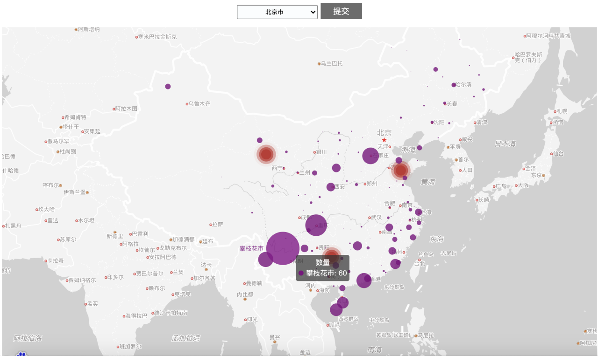

# Based-on-Hadoop-K-means-clustering-algorithm-Parallel-implementation

## Project Description
Use the Hadoop platform and MapReduce programming model to complete the parallel implementation of the K-means clustering algorithm under big data, and apply it to the tourist travel city preference analysis of cities in China
The project mainly consists of three parts
- Big data K-means parallel clustering（hadoop_kmeans folder）
- K-means parallel clustering application（application_hadoop_kmeans folder）
- Tourist preference Page display（web_hadoop_kmeans folder）

###  Big data K-means parallel clustering
Using hadoop's mapreduce programming model, through the K-means clustering algorithm, complete the cluster analysis of 4 million pieces of data, and realize it in the following three environments:
- Stand-alone
- pseudo-distributed
- fully distributed
### K-means parallel clustering application
Use hadoop's mapreduce programming model, through the K-means clustering algorithm, and use the crawled ticket data to analyze the tourist preferences of provincial capital cities
- Airline data preprocessing
- Cluster analysis of all capital cities
### Tourist preference Page display
Use the Python Flask framework and Baidu Map API to analyze the tourist city preferences of tourists in various cities
- The more times you go to a city, the bigger the point
- You can select the corresponding city through the drop-down box

